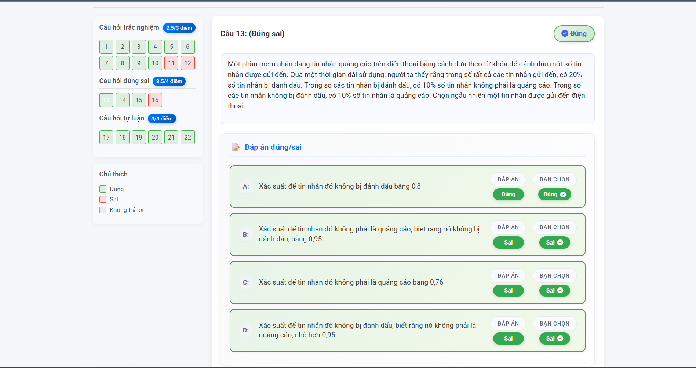
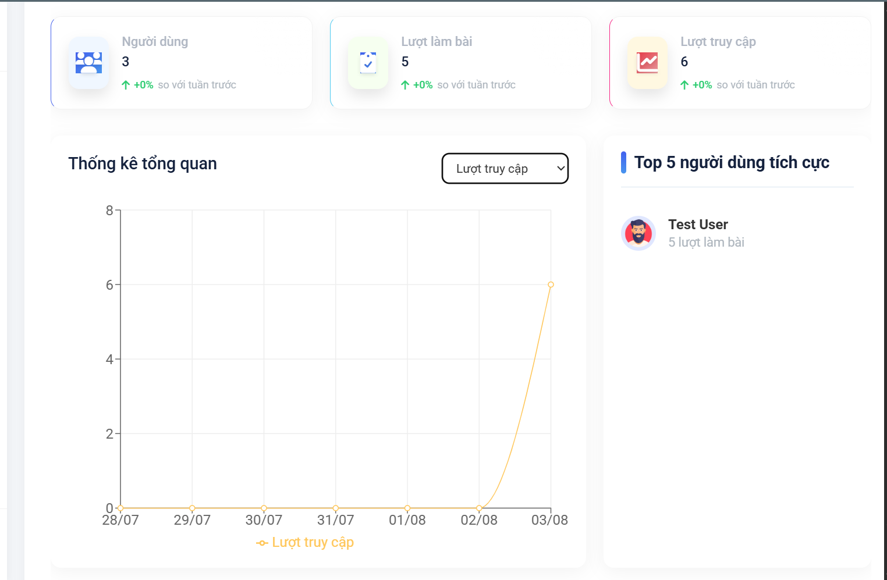

# High School Exam Prep App

## Table of Contents
- [Description](#description)
- [Features](#features)
- [Tech Stack](#tech-stack)
- [Prerequisites](#prerequisites)
- [Installation](#installation)
  - [Backend Setup](#backend-setup)
  - [Frontend Setup](#frontend-setup)
- [Environment Variables](#environment-variables)
 - [Usage](#usage)
 - [Application Interface](#application-interface)
- [Project Structure](#project-structure)
- [Contributing](#contributing)
- [License](#license)

## Description
High School Exam Prep App is a full-stack web application built to support Vietnamese high school students in their learning journey. It provides features such as user authentication, online tests, study time tracking, and real-time statistics. Administrators can manage content, view detailed usage analytics, and moderate user activities.

## Features
- User registration and JWT-based authentication
- Role-based access control (student, admin)
- Online test module with timed exams and automatic grading
- Study time tracking sessions (start/end session)
- Real-time statistics dashboard with charts
- File uploads for user avatars and blog images
- Socket.io notifications for live updates

## Tech Stack
- **Backend**: Node.js, Express.js, MongoDB, Mongoose, JWT, Socket.io
- **Frontend**: React (Create React App), CSS Modules, Context API

## Prerequisites
- Node.js (v14 or higher)
- npm or yarn package manager
- MongoDB instance (local or hosted on MongoDB Atlas)

## Installation
First, clone the repository and navigate into the project folder:
```powershell
git clone https://github.com/police23/myproject_thpt.git
cd myproject_thpt
```

### Backend Setup
1. Navigate to the backend directory:
   ```powershell
   cd backend
   ```
2. Install dependencies:
   ```powershell
   npm install
   ```
3. Create a `.env` file in `backend/` and define the following variables (see [Environment Variables](#environment-variables))
4. Initialize or reset the database schema (optional):
   ```powershell
   npm run db-setup
   ```
5. Start the development server:
   ```powershell
   npm run dev
   ```

### Frontend Setup
1. Open a new terminal and navigate to the frontend folder:
   ```powershell
   cd frontend
   ```
2. Install dependencies:
   ```powershell
   npm install
   ```
3. Start the React development server:
   ```powershell
   npm start
   ```

## Environment Variables
Create a `.env` file in the `backend/` directory with the following keys:
```dotenv
MONGODB_URI=<your_mongodb_connection_string>
JWT_SECRET=<your_jwt_secret_key>
PORT=5000
# Optional email settings for Nodemailer
EMAIL_HOST=<smtp_host>
EMAIL_PORT=<smtp_port>
EMAIL_USER=<smtp_user>
EMAIL_PASS=<smtp_password>
```

## Usage
- Access the frontend at `http://localhost:3000`
- API endpoints are served at `http://localhost:5000/api`
- Use the registration and login pages to create or sign in to your account
 - Admin users can access the dashboard and management panels via the navigation menu

## Application Interface

Below are some screenshots of the application:

### Authentication

#### Login Page


#### Register Page


#### Forgot Password Page


#### Enter OTP Page


#### Reset Password Page


### User Profile & Settings

#### User Profile


#### Change Password


### Study Features

#### Study Time Tracking


#### Target Page


### Test Taking and Review

#### Test Taking (1)


#### Test Taking (2)


#### Test Taking (3)


#### Tests List


#### Test Review (1)


#### Test Review (2)


#### Test Review (3)


#### Test Review (4)


#### Info Test


#### Test Result


### Test Management (Admin)

#### Add Test


#### Add Test (1)


#### Add Test (2)


#### Add Test (3)


#### Test Management


#### Notification


### Admin Dashboard



### User Management


## Contributing
Contributions are welcome! Please follow these steps:
1. Fork the repository
2. Create a new branch (`git checkout -b feature/my-feature`)
3. Commit your changes (`git commit -m 'Add new feature'`)
4. Push to your branch (`git push origin feature/my-feature`)
5. Open a pull request

## License
This project is licensed under the MIT License. See the [LICENSE](LICENSE) file for details.